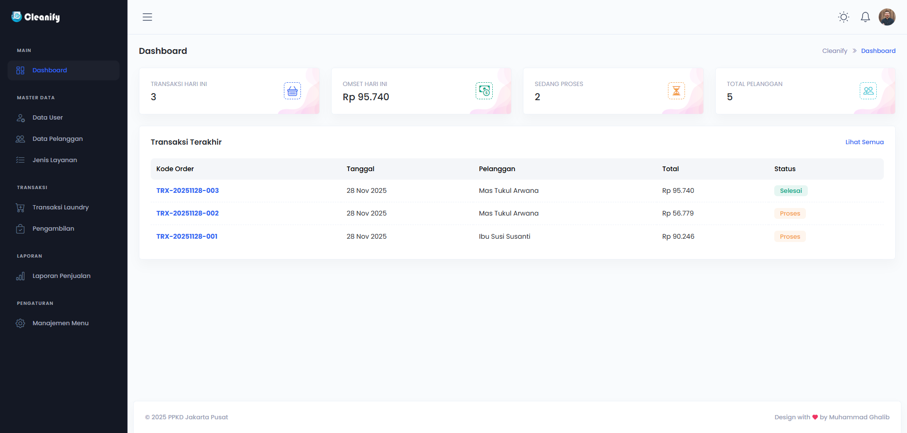

# 🧺 Cleanify - Sistem Informasi Manajemen Laundry Terintegrasi


**Cleanify** adalah aplikasi manajemen operasional laundry berbasis web yang dirancang untuk efisiensi tinggi. Aplikasi ini mendukung manajemen multi-role, perhitungan transaksi otomatis (Server-Side Calculation), manajemen menu dinamis, dan pelaporan keuangan real-time.

---



## 📑 Daftar Isi

1. [Fitur Utama](#-fitur-utama)
2. [Arsitektur Sistem](#-arsitektur-sistem)
3. [Struktur Database (ERD)](#-struktur-database-erd)
4. [Persyaratan Sistem](#-persyaratan-sistem)
5. [Panduan Instalasi](#-panduan-instalasi)
6. [Panduan Penggunaan (User Manual)](#-panduan-penggunaan)
7. [Troubleshooting](#-troubleshooting)

---

## 🚀 Fitur Utama

### A. Manajemen Akses (RBAC)

Sistem menggunakan **Role-Based Access Control** dengan 3 level pengguna:

1.  **Administrator:**
    -   Mengelola Master Data (User, Pelanggan, Layanan/Paket).
    -   **Dynamic Sidebar Manager:** Menambah/Mengedit menu sidebar langsung dari aplikasi tanpa coding.
    -   **Role Management:** Mengatur hak akses level secara dinamis.
2.  **Operator (Kasir):**
    -   Melakukan Transaksi Laundry (Kiloan/Satuan).
    -   Mencetak Struk (Invoice) format Thermal 58mm/80mm.
    -   Memproses Pengambilan (Pickup) & Pembayaran.
3.  **Pimpinan (Owner):**
    -   Melihat Dashboard Statistik (Omset Harian, Total Pelanggan).
    -   Mencetak Laporan Penjualan per Periode.

### B. Fitur Unggulan Lainnya

-   **Smart Calculation:** Perhitungan Subtotal, Pajak (PPN), dan Biaya Admin dilakukan di backend untuk mencegah manipulasi harga di browser.
-   **Hybrid Input:** Mendukung input manual (diskon/biaya lain) dan otomatis.
-   **Decimal Support:** Mendukung input berat desimal (misal: 1.5 Kg).
-   **Secure Transaction:** Menggunakan Database Transaction (Rollback otomatis jika simpan data gagal).

---

## 🏗 Arsitektur Sistem

Aplikasi ini dibangun menggunakan pola **MVC (Model-View-Controller)** dengan spesifikasi:

-   **Backend:** Laravel 11 Framework.
-   **Database:** MySQL dengan relasi Foreign Key & Indexing.
-   **Frontend:** Blade Templating Engine + Bootstrap 5.
-   **Authentication:** Laravel Breeze / Custom Auth Logic.
-   **Security:** CSRF Protection, XSS Filtering, SQL Injection Prevention (Eloquent ORM).

---

## 🗄 Struktur Database (ERD)

Berikut adalah tabel-tabel inti dalam sistem ini:

| Nama Tabel             | Deskripsi                            | Relasi Utama               |
| :--------------------- | :----------------------------------- | :------------------------- |
| `users`                | Data pengguna login                  | `belongsTo` Level          |
| `level`                | Hak akses (Admin, Operator, dll)     | `hasMany` Users            |
| `customer`             | Data pelanggan laundry               | `hasMany` TransOrder       |
| `type_of_service`      | Master data layanan & harga          | `hasMany` OrderDetail      |
| `trans_order`          | Header transaksi (Kode, Tgl, Status) | `belongsTo` User, Customer |
| `trans_order_detail`   | Rincian item per transaksi           | `belongsTo` Order, Service |
| `trans_laundry_pickup` | Log pengambilan & pelunasan          | `belongsTo` Order          |
| `menus`                | Konfigurasi menu sidebar dinamis     | `belongsToMany` Level      |

---

## 💻 Persyaratan Sistem

Pastikan server/komputer Anda memenuhi spesifikasi berikut:

-   **PHP:** Versi 8.2 atau lebih baru.
-   **Composer:** Versi 2.x.
-   **Database:** MySQL 5.7+ atau MariaDB 10.3+.
-   **Web Server:** Apache (via XAMPP/Laragon) atau Nginx.
-   **Node.js:** (Opsional) Untuk compile aset CSS/JS.

---

## 📦 Panduan Instalasi

Ikuti langkah-langkah berikut untuk menjalankan proyek ini di komputer lokal (Localhost):

### 1. Clone Repository

Buka terminal/CMD, arahkan ke folder `htdocs` atau folder proyek kamu:

```bash
git clone https://github.com/mghalibb/laundry-laravel-2025.git
cd cleanify-laundry
```

### 2. Install Dependency

-Pastikan Composer dan Node.js sudah terinstall.

```bash
composer install
npm install && npm run build
```

### 3. Konfigurasi Environment

-Duplikat file .env.example dan ubah namanya menjadi .env. Lalu atur koneksi database:

```bash
cp .env.example .env
```

-Buka file .env dan atur koneksi database:

```bash
DB_CONNECTION=mysql
DB_HOST=127.0.0.1
DB_PORT=3306
DB_DATABASE=laundry-laravel-2025
DB_USERNAME=root
DB_PASSWORD=
```

### 4. Generate Key & Database

-Jalankan perintah ini untuk membuat key aplikasi dan mengisi database awal (Seeder):

```bash
php artisan key:generate
php artisan migrate
php artisan migrate:fresh --seed
```

### 5. Jalankan Server

```bash
php artisan serve
npm run dev
```

-Buka browser dan akses: http://127.0.0.1:8000

## 🔑 Akun Demo (Default Login)

-Gunakan akun berikut untuk masuk ke aplikasi:

| Nama Role       | Email                      | Password |
| :-------------- | :------------------------- | :------- |
| `Administrator` | administrator123@gmail.com | admin123 |
| `Operator`      | operator123@gmail.com      | admin123 |
| `Pimpinan`      | owner123@gmail.com         | admin123 |
