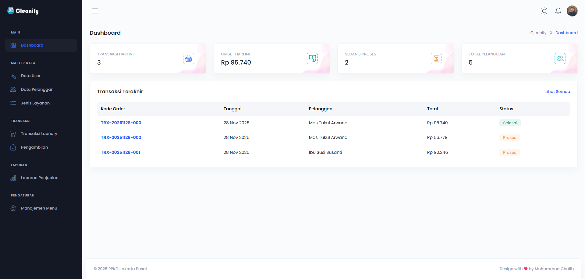

# 🧺 Cleanify - Sistem Informasi Manajemen Laundry

Cleanify adalah aplikasi manajemen operasional laundry berbasis web yang dibangun menggunakan **Laravel 12**. Aplikasi ini dirancang untuk memenuhi standar Uji Kompetensi (UJIKOM) dengan fitur lengkap mulai dari manajemen pelanggan, transaksi harian, struk digital, hingga laporan keuangan.



## 🚀 Fitur Unggulan

### 1. Multi-Level User (RBAC)

Aplikasi ini membatasi akses berdasarkan peran pengguna:

-   **Administrator:** Mengelola Master Data (User, Outlet, Paket), Manajemen Menu Sidebar, dan Konfigurasi Sistem.
-   **Operator:** Fokus pada operasional harian (Transaksi Laundry & Proses Pengambilan/Pickup).
-   **Pimpinan:** Akses khusus untuk memantau Laporan Penjualan & Statistik.

### 2. Fitur Kunci Lainnya

-   **Dynamic Sidebar Management:** Menu sidebar bisa ditambah, diedit, atau diurutkan langsung dari aplikasi (Database Driven), tanpa perlu mengubah kodingan.
-   **Server-Side Calculation:** Perhitungan harga, pajak (PPN), dan biaya admin dilakukan di backend untuk menjamin keakuratan dan keamanan data.
-   **Struk Thermal Support:** Desain struk responsif yang mendukung printer thermal ukuran **58mm** dan **80mm**.
-   **Laporan Real-time:** Filter laporan pendapatan berdasarkan rentang tanggal.

## 🛠️ Teknologi yang Digunakan

-   **Backend Framework:** Laravel 12
-   **Language:** PHP 8.2+
-   **Database:** MySQL 8.0
-   **Frontend:** Blade Templating
-   **Styling:** Bootstrap 5 / Custom CSS
-   **Icons:** Bootstrap Icons & Iconoir

## 📦 Panduan Instalasi (Installation)

Ikuti langkah-langkah berikut untuk menjalankan proyek ini di komputer lokal (Localhost):

### 1. Clone Repository

Buka terminal/CMD, arahkan ke folder `htdocs` atau folder proyek kamu:

```bash
git clone https://github.com/mghalibb/laundry-laravel-2025.git
cd cleanify-laundry
```

### 2. Install Dependency

Pastikan Composer dan Node.js sudah terinstall.

composer install
npm install && npm run build

### 3. Konfigurasi Environment

Duplikat file .env.example dan ubah namanya menjadi .env. Lalu atur koneksi database:

DB_CONNECTION=mysql
DB_HOST=127.0.0.1
DB_PORT=3306
DB_DATABASE=laundry-laravel-2025
DB_USERNAME=root
DB_PASSWORD=

### 4. Generate Key & Database

Jalankan perintah ini untuk membuat key aplikasi dan mengisi database awal (Seeder):

php artisan key:generate
php artisan migrate
php artisan migrate:fresh --seed

### 5. Jalankan Server

php artisan serve

Buka browser dan akses: http://127.0.0.1:8000

🔑 Akun Demo (Default Login)
Gunakan akun berikut untuk masuk ke aplikasi:
Role                Email        	                Password
Administrator	    administrator123@gmail.com	    admin123
Operator	        operator123@gmail.com	        admin123
Pimpinan	        owner123@gmail.com	            admin123
